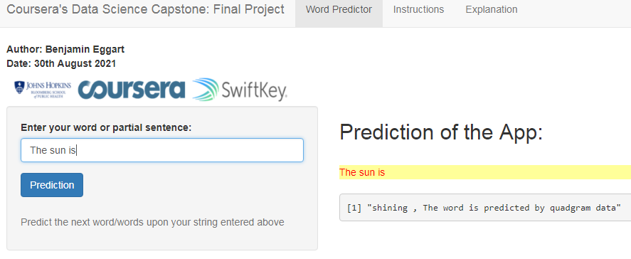

## Overview

This project creates a text-prediction application with R. It uses the Shiny packages to build the application. The app predicts words using a natural language processing model.

The user can input a word or a phrase and the application will try to predict the next word. Typically, this is known from most smart phone keyboards, where the technology is known as *Swiftkey*.

A collection of written texts, called the **HC Corpora** is used as training data for the predictive model. The data was filtered by English language before. 

## The Prediction Model

The model uses the principles of **tidy data** together with text mining in R. In principle the following major steps are involved in the prediction model.

* Raw text files for model training is used as an input
* The raw data is cleaned and separated into 2, 3, 4, 5, and 6 word n-grams and saved as tibbles
* The n-grams tibbles are sorted by frequency and saved as *.rds* files
* N-grams function uses a **back-off** type prediction model
* User delivers an input string
* The model uses last 5, 4, 3, 2, or 1 words to predict the best 6th, 5th, 4th, 3rd, or 2nd match in the data
* The model outputs a prediction - the next word

## Word Predictor App

The Word Predictor app has a simple user interface for the prediction model. The app takes as input a phrase or multiple words in a text box. This string is then used to predict the next word.

## References

*Github* https://github.com/beggart/Coursera-Final-Project

*Tidy Data* http://vita.had.co.nz/papers/tidy-data.html

*Text Mining with R - A Tidy Approach* http://tidytextmining.com/index.html

*Predictor App* https://oktoberfestpredictor.shinyapps.io/Word-Predictor/

